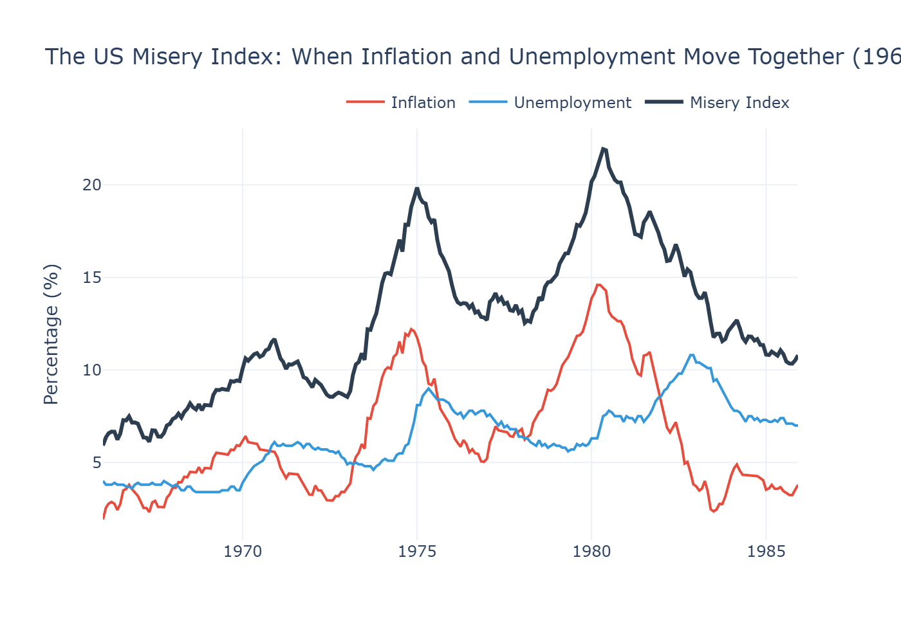
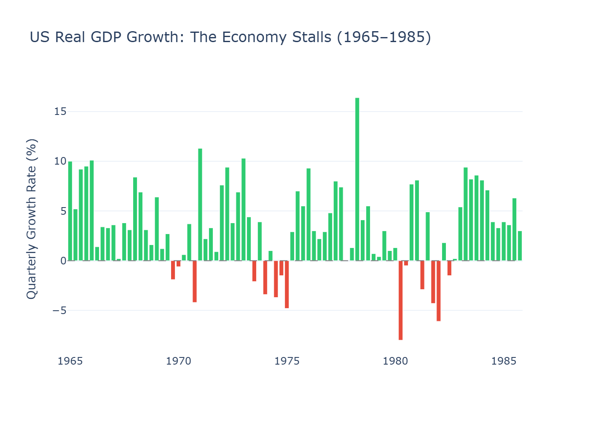
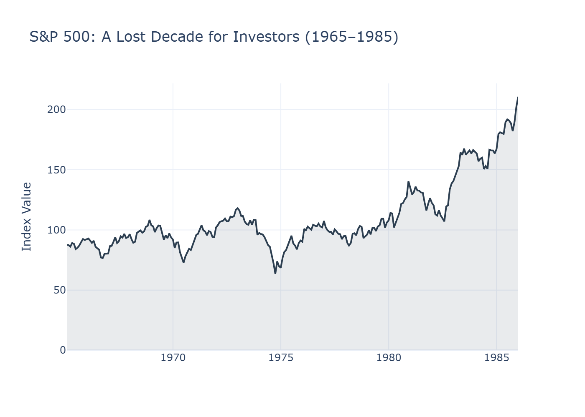
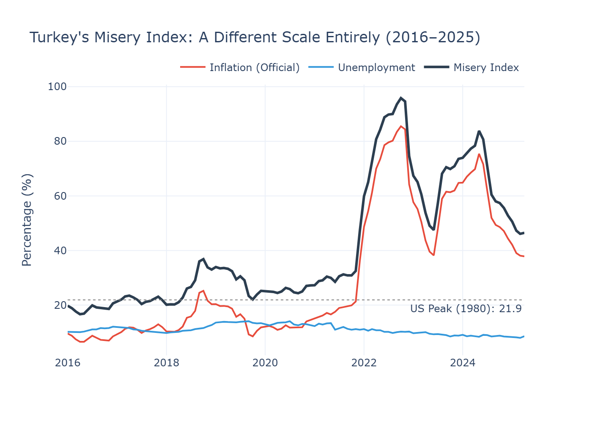
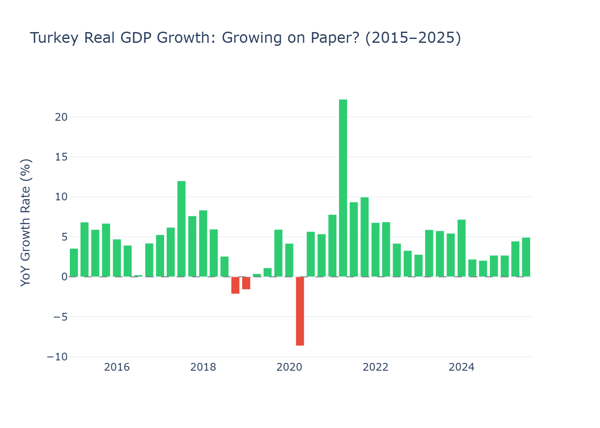
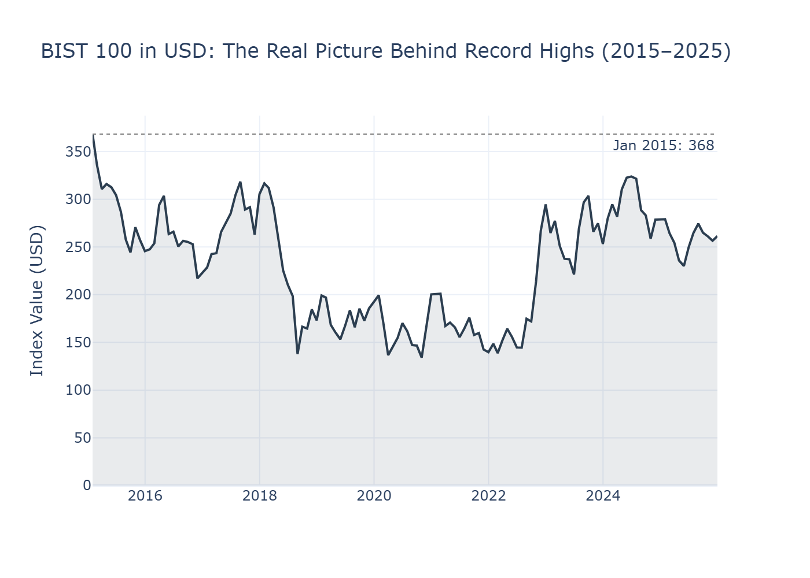
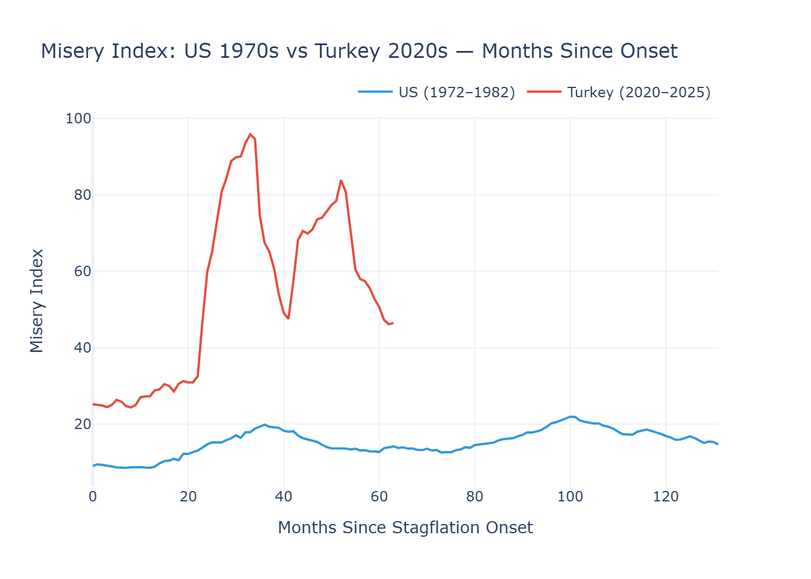

# Stagflation

In 1958, a New Zealand economist named William Phillips published a paper examining 97 years of British wage and unemployment data. He found something elegant: when unemployment was low, wages (and therefore prices) rose faster. When unemployment was high, inflation slowed down. Plot it on a graph and you get a neat downward-sloping curve. Policymakers loved it. It implied a menu of choices — you could buy lower unemployment by tolerating a bit more inflation, or bring inflation down by accepting higher joblessness. Pick your poison.

For about a decade, this seemed to work. Then the 1970s happened, and the Phillips Curve broke.

Inflation and unemployment started rising *together*. This wasn't supposed to be possible. British politician Iain Macleod, watching his country's economy deteriorate in 1965, mashed two words together to describe what he was seeing: *stagnation* plus *inflation*. Stagflation.

The definition is straightforward: high inflation, stagnant or negative economic growth, and rising unemployment — all at the same time. The problem is that the standard policy toolkit falls apart when you face all three. Raise interest rates to fight inflation? You'll crush growth and spike unemployment. Cut rates to stimulate the economy? You'll pour gasoline on inflation. There's no clean move. Every option hurts somebody.

In the 1970s, Yale economist Arthur Okun came up with a simple metric to capture this pain. He called it the Misery Index: just add the inflation rate to the unemployment rate. The higher the number, the worse people feel. It's crude, but it works.

This article does two things. First, it looks at the most famous case of stagflation in modern history — the United States in the 1970s — to understand what it looks like when the data confirms the diagnosis. Then it turns to Turkey, where the question is less clear-cut but arguably more urgent.

---

## The Textbook Case: America, 1972–1982

The story of US stagflation usually starts with oil, but the roots go deeper.

Throughout the 1960s, the US government operated under the assumption that the Phillips Curve was a permanent menu. The 1946 Employment Act had effectively committed Washington to keeping unemployment low, and the Federal Reserve accommodated this by running loose monetary policy. Inflation crept up gradually — from about 1% in 1964 to nearly 6% by 1970 — but nobody panicked. The economy was growing. Jobs were plentiful.

Then came the external shocks. In October 1973, OPEC imposed an oil embargo against the United States in retaliation for its support of Israel during the Yom Kippur War. Oil prices quadrupled almost overnight. Because petroleum is embedded in practically everything — transportation, manufacturing, agriculture, plastics, heating — the cost increase rippled through the entire economy. Prices surged. Businesses, facing higher input costs and weaker demand, started laying off workers.

And here's where the Phillips Curve shattered: inflation was rising *and* unemployment was rising. The neat inverse relationship wasn't holding. Milton Friedman and Edmund Phelps had actually predicted this — they argued that once workers and businesses started *expecting* inflation, the tradeoff would disappear. The Phillips Curve would shift, and you'd get stuck with high inflation at any level of unemployment. That's exactly what happened.

The Federal Reserve, under Chairman Arthur Burns, tried the old playbook — tightening a little, then easing when unemployment ticked up. This "stop-go" approach made things worse. Each time the Fed backed off, inflation expectations ratcheted higher. A second oil shock in 1979, triggered by the Iranian Revolution, pushed the economy further into crisis.

The data tells the story clearly.

Look at what happens between 1972 and 1980. The Misery Index — the simple sum of inflation and unemployment — climbs from around 10 to nearly 22. By May 1980, inflation was running at 14.6% while unemployment sat above 7%. The economy was experiencing its worst peacetime combination of price increases and joblessness since the Great Depression.

The GDP chart shows the damage in a different way. Notice how the red bars — quarters of negative growth — cluster in 1974–75 and again in 1980. The second quarter of 1980 saw the economy contract by 8% on an annualized basis. But this wasn't ordinary recession. In a normal downturn, inflation eases as demand weakens. Here, prices kept climbing even as the economy shrank.

And then there's the stock market. The S&P 500 essentially went nowhere from 1968 to 1982 — fourteen years of sideways movement in nominal terms. Adjust for inflation and investors lost roughly half their purchasing power over that period. The phrase "lost decade" gets thrown around a lot in finance. This was a lost decade and a half.

### The Bitter Medicine

The turning point came in August 1979, when Paul Volcker was appointed Federal Reserve Chairman. Volcker understood something his predecessors hadn't fully committed to: you can't cure stagflation with half-measures. Inflation expectations had become entrenched. Workers demanded higher wages because they expected prices to keep rising. Businesses raised prices because they expected costs to keep climbing. The only way to break this cycle was to make borrowing so expensive that economic activity would contract enough to force prices down.

Volcker raised the federal funds rate to 20%. The prime rate hit 21.5%. Mortgage rates exceeded 18%.

The result was predictable and devastating. The economy plunged into recession in 1980, briefly recovered, then entered an even deeper downturn in 1981–82. Unemployment peaked at 10.8% in November 1982. Farmers drove tractors to the Federal Reserve building in protest. Car dealers mailed coffins full of unsold car keys to Washington. Members of Congress called for Volcker's resignation and even threatened impeachment.

But it worked. Inflation fell from nearly 15% in 1980 to under 4% by 1983. Once the fever broke, the economy entered a sustained expansion. The S&P 500 — stuck below 120 for over a decade — broke out and never looked back.

The lesson that central bankers took from this episode is uncomfortable but widely accepted: once inflation expectations become unanchored, the only reliable cure is a painful, deliberate contraction. There are no shortcuts. The longer you wait, the more it costs.

---

## Turkey: A Familiar Pattern at a Different Scale

Now let's turn to Turkey, where the conversation gets more complicated.

On paper, Turkey doesn't neatly fit the technical definition of stagflation. The economy has been growing — official GDP figures show positive year-over-year growth in most recent quarters. Unemployment, while elevated, hasn't spiked to crisis levels in the official data. By strict textbook criteria, calling this stagflation requires qualification.

But here's the thing: ask a shopkeeper in Istanbul, a factory owner in Kayseri, or a farmer in Southeastern Anatolia how the economy feels, and you'll hear a different story than the one GDP numbers tell. Business owners and tradespeople across the country have been describing stagflationary conditions for some time now. They see it in declining sales volumes, rising input costs, customers who simply stop buying. The formal economic indicators often lag what people on the ground are already experiencing.

This gap between official statistics and lived reality is worth acknowledging. Turkey's official inflation data, published by TÜİK (the Turkish Statistical Institute), has been a subject of ongoing debate. Independent research groups have published alternative calculations that diverge significantly from official figures — in some periods, the gap has been enormous. We're using official data throughout this analysis because it's what's consistently available and internationally comparable. But it's worth noting that if alternative estimates are closer to the truth, everything you're about to see understates the actual situation.

### How We Got Here

Turkey's current predicament didn't materialize overnight. Understanding it requires looking at the monetary policy decisions — and missteps — that preceded it.

Starting around 2010, and accelerating after 2018, Turkey's central bank kept interest rates persistently lower than standard monetary policy frameworks would suggest. This was driven by political pressure from the top. Between 2019 and 2023, four central bank governors were removed from their positions — a pace of turnover that made it difficult for any coherent long-term policy to take hold. One governor, Naci Ağbal, was dismissed in March 2021, just two days after implementing a larger-than-expected rate hike that markets had actually welcomed.

The most dramatic phase came in late 2021. While central banks in the US, Europe, and most of the developed world were raising interest rates to combat post-pandemic inflation, Turkey's central bank was cutting them. The policy rate was reduced from 19% to 8.5% over roughly a year, even as inflation was already accelerating.

The logic, articulated at the highest levels of government, was unconventional: that high interest rates *cause* inflation rather than cure it. This view contradicts the consensus of mainstream economics — essentially the opposite of what Volcker demonstrated in 1980. The result was a textbook case of what happens when you run expansionary monetary policy into an inflationary environment: the Turkish lira went into freefall, imported inflation surged (Turkey is heavily dependent on imported energy and raw materials), and consumer prices spiraled.

Official inflation peaked at 85.5% in October 2022.

After the 2023 elections, there was a policy reversal. Mehmet Şimşek was appointed as finance minister, signaling a return to more orthodox economic management. The central bank, under new leadership, began raising rates aggressively. But the damage from years of unorthodox policy had already compounded.

### The Numbers

This chart deserves a moment. The dashed gray line represents the peak US Misery Index during the 1970s stagflation — the worst economic period in modern American history. Turkey has been above that line almost continuously since 2021. The Misery Index peaked at 95.8 in October 2022 — more than four times the worst the United States experienced under stagflation. Even at its most recent reading of 46.5, it remains roughly double the American peak.

And remember: this uses official inflation figures.

There's something else notable in this chart. Look at the unemployment line — it's remarkably flat compared to the inflation spike. In the US, both inflation and unemployment moved together, which is what makes stagflation stagflation. In Turkey, the Misery Index is overwhelmingly driven by inflation. Official unemployment sits around 8-9%, but broad unemployment — which includes discouraged workers and those underemployed — has been reported considerably higher. The official metric may not be capturing the full picture of labor market distress.

The GDP chart raises an interesting question. Turkey appears to be growing at respectable rates — 3-5% in recent quarters. This is the main reason why a strict diagnosis of stagflation is debatable. But consider this: when inflation is running at 40-85%, what does 5% "real" growth actually mean for ordinary people? The deflator used to calculate real GDP from nominal GDP relies on official inflation figures. If actual price increases are higher than what's reported, real growth would be lower — potentially significantly so.

This isn't a claim that the data is wrong. It's an observation that in high-inflation environments, the gap between statistical reality and experienced reality can be wide.

Then there's the stock market. In Turkish lira terms, the BIST 100 has hit record after record in recent years. Financial headlines celebrate new all-time highs. But convert to US dollars — which strips out the currency depreciation — and the picture is starkly different. The BIST 100 in dollar terms is still below where it was in January 2015. A decade of record-breaking nominal highs, and a foreign investor holding BIST since 2015 would still be underwater. This mirrors the S&P 500's "lost decade" during US stagflation, though the mechanism is different: in the US, the index went sideways in nominal terms; in Turkey, it soars in lira but sinks in hard currency.

### The Comparison

To compare these two episodes side by side, we aligned both to a common starting point — month zero. For the US, this is January 1972, the year before the OPEC embargo. For Turkey, it's January 2020, when inflation began its sustained acceleration. These are editorial choices — shifting the start date by a year in either direction would change the overlay's shape. The point isn't that these episodes are identical. They aren't. The point is scale.

The US Misery Index fluctuated between roughly 10 and 22 over the course of its entire stagflationary episode. Turkey blew past that range within 30 months and reached nearly 96. Even after a significant pullback, it remains in territory the US never approached.

### Where It Differs

The parallels between 1970s America and 2020s Turkey are real but imperfect. A few key differences are worth noting.

The US stagflation was primarily triggered by external supply shocks — oil embargoes that no domestic policy could have prevented. Turkey's situation is more self-inflicted. Years of unorthodox monetary policy eroded the central bank's credibility, unanchored inflation expectations, and left the economy vulnerable when global inflationary pressures arrived after COVID.

In the US, the Phillips Curve broke because the economy was hit by something economists hadn't modeled well — supply-side shocks during a period of already-loose monetary policy. In Turkey, the relationship between inflation and growth has been distorted by a different mechanism: artificially suppressed interest rates and political interference in monetary policy.

The US had the luxury of being the world's reserve currency issuer. When Volcker raised rates, capital flowed *into* the dollar. Turkey doesn't have that advantage. Tight monetary policy is necessary but comes with the risk of capital flight, currency pressure, and political instability.

And perhaps most importantly: the US needed about three years of painful adjustment under Volcker to break inflation. Turkey's challenges may require not just monetary tightening but structural reforms — improvements in institutional independence, fiscal discipline, and policy credibility — that take considerably longer to implement.

---

## What Now?

This article can't tell you whether Turkey is definitively "in" stagflation. By the strict definition, GDP growth remains positive and official unemployment hasn't reached crisis levels. By the lived experience of millions of people navigating an economy where prices have doubled or tripled while wages lag behind, the label may feel inadequate in the other direction — things feel worse than "mere" stagflation.

What the data does show is that Turkey's economic pain, however you label it, is operating at a scale that dwarfs the most famous stagflationary episode in modern economic history. And the policy missteps that contributed to it — particularly the prolonged period of artificially low interest rates — have made the path to recovery more difficult than it needed to be.

History suggests that there are no painless exits from situations like this. Volcker's cure worked, but it cost the US economy two recessions and double-digit unemployment. Countries that have emerged from similar spirals have generally needed not just monetary discipline but broader structural reforms to restore credibility and rebuild expectations. The longer the delay, the higher the eventual cost tends to be.

---

**Technical Notes**

*Data Sources:*
- US data: Federal Reserve Economic Data (FRED) — CPI (CPIAUCSL), Unemployment Rate (UNRATE), Real GDP Growth (A191RL1Q225SBEA), S&P 500 (Yahoo Finance)
- Turkey data: FRED/OECD — CPI (TURCPIALLMINMEI), Unemployment Rate (LRHUTTTTTRM156S), Real GDP Growth (TURGDPRQPSMEI), BIST 100 & USD/TRY (Yahoo Finance)

*Methodology:*
- Analysis: Python (pandas, plotly)
- Misery Index = Year-over-year inflation rate + Unemployment rate
- BIST 100 USD conversion: BIST 100 TL closing price / USD-TRY exchange rate
- Comparison chart normalization: Both series aligned to "month 0" at respective stagflation onset dates (US: Jan 1972, Turkey: Jan 2020)
- All inflation figures calculated as 12-month percentage change in CPI index

*References:*
- "Slow but Not Steady: The Fight Against Stagflation in the 1970s" — Georgetown Law, Denny Center
- "Stagflation in the 1970s" — Investopedia
- "The Great Inflation" — Federal Reserve History
- "Exchange Rate and Inflation Under Weak Monetary Policy: Turkey Verifies Theory" — Gürkaynak, Kısacıkoğlu, Lee (Economic Policy, Oxford Academic)
- "Stagflasyon Sinyalleri" — Mahfi Eğilmez

*Note on Turkish inflation data:* Official figures from TÜİK are used throughout. Independent research groups have published alternative inflation calculations that differ significantly from official statistics. This analysis uses official data for consistency and international comparability.

Full code, data, and notebooks: [github.com/alpcakin](https://github.com/alpcakin)

[linkedin.com/in/alp-cakin](https://www.linkedin.com/in/alp-cakin)